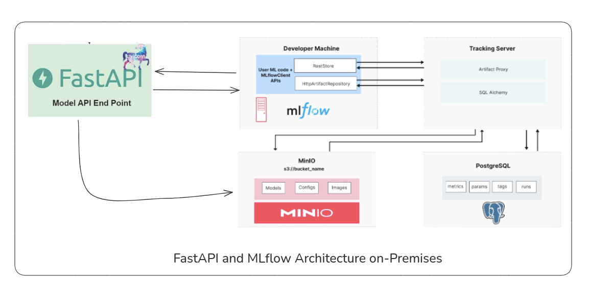

# mlflow-data-analysis-ml

### Arquitetura de Implementação de API com FastAPI e MLflow Integrada com MinIO e PostgreSQL

Ambiente local para análise de dados e construção de modelos de machine learning utilizando MLflow e Docker. Inclui configuração com Docker Compose para integração com PostgreSQL e MinIO, facilitando o rastreamento de experimentos e o gerenciamento de artefatos e metadados em projetos de ciência de dados.



## Tecnologias Utilizadas

- **FastAPI**: Um framework moderno e rápido para construir APIs com Python, ideal para integração de modelos de machine learning em ambientes de produção.
- **MLflow**: Plataforma de código aberto para gerenciar o ciclo de vida de modelos de machine learning, incluindo rastreamento de experimentos, deployment de modelos e gerenciamento de artefatos.
- **MinIO**: Armazenamento de objetos compatível com S3, utilizado para armazenar os artefatos gerados durante o treinamento do modelo, como arquivos de modelo e logs.
- **PostgreSQL**: Banco de dados relacional utilizado para armazenar os parâmetros, métricas, tags e execuções dos experimentos rastreados pelo MLflow.
- **Docker & Docker Compose**: Ferramentas para containerização e orquestração de ambientes, permitindo que todas as partes da aplicação sejam executadas de forma isolada e eficiente.

## Como Executar o Projeto

### Pré-requisitos

- [Docker](https://docs.docker.com/get-docker/) instalado.
- [Docker Compose](https://docs.docker.com/compose/install/) instalado.

### Passos para execução

1. Clone o repositório:
   ```bash
   git clone https://github.com/Gefte/mlflow-data-analysis-ml.git
   cd mlflow-data-analysis-ml
   ```

2. Inicie os serviços usando Docker Compose:
   ```bash
   docker-compose up --build
   ```

   Isso irá construir e iniciar os serviços:
   - Jupyter Notebook
   - MLflow Tracking Server
   - FastAPI para o modelo
   - MinIO para armazenamento de artefatos
   - PostgreSQL para armazenar os metadados dos experimentos

3. Acesse os serviços:
   - Jupyter Notebook: `http://localhost:8888` (token configurado como `mlflow`)
   - MLflow Tracking UI: `http://localhost:5000`
   - MinIO Console: `http://localhost:8900` (usuário: `mlflow`, senha: `password`)
   - API FastAPI: `http://localhost:8000/docs` para acessar a documentação interativa da API.

### Estrutura dos Serviços

- **Jupyter Notebook**: O ambiente interativo para análise de dados e desenvolvimento de modelos. A pasta `/notebooks` está mapeada para o diretório local para fácil edição e persistência dos notebooks.
- **MLflow Tracking Server**: Responsável por armazenar e gerenciar os experimentos de machine learning, conectando-se ao PostgreSQL para armazenar metadados e ao MinIO para armazenar artefatos.
- **MinIO**: Armazena os modelos treinados, bem como outros artefatos necessários, usando a interface S3.
- **PostgreSQL**: Banco de dados para registrar todas as execuções, parâmetros e métricas geradas pelo MLflow.
- **FastAPI**: API que expõe endpoints para validação de modelos e previsões de dados de vinho, com integração ao MLflow para carregar os modelos treinados e ao MinIO para armazenar os dados de entrada e saída das previsões.

### Exemplo de Uso da API

1. Para verificar o status de saúde da API:
   ```bash
   GET /api/health
   ```

2. Para realizar uma previsão com um conjunto de características de vinho:
   ```bash
   POST /api/predict
   ```

   Exemplo de corpo da requisição:
   ```json
   {
     "alcohol": 13.0,
     "malic_acid": 2.0,
     "ash": 2.5,
     "alcalinity_of_ash": 15.0,
     "magnesium": 100,
     "total_phenols": 2.0,
     "flavanoids": 2.5,
     "nonflavanoid_phenols": 0.3,
     "proanthocyanins": 1.5,
     "hue": 1.0,
     "od280_od315_of_diluted_wines": 3.0,
     "proline": 800
   }
   ```

   A resposta será a previsão do modelo, e os dados de entrada e saída serão armazenados no MinIO.


### Observação sobre as Configurações dos Volumes

No arquivo `docker-compose.yml`, os volumes mapeiam diretórios locais para os containers do Docker. Se você estiver utilizando um sistema diferente ou se os caminhos especificados não corresponderem à sua estrutura de diretórios, é importante ajustar os paths para refletirem o local correto em seu sistema.

Exemplo:
```yaml
volumes:
  - '/caminho/para/seu/projeto/notebooks:/home/jovyan/work'
```
Certifique-se de que os caminhos locais especificados existem e estão acessíveis para evitar erros durante a execução dos containers.

#### Observação para Ambientes Linux

Se você estiver utilizando o ambiente Linux, certifique-se de conceder as permissões corretas ao diretório dos notebooks antes de iniciar os containers. Isso evitará problemas de acesso ao diretório montado no Jupyter.

Execute o seguinte comando para liberar as permissões:

```bash
sudo chmod -R 777 '/caminho/para/seu/projeto/mlflow-data-analysis-ml/notebooks'
```

Essa configuração garante que o Docker tenha as permissões necessárias para acessar e modificar os arquivos no diretório local.


### Considerações Finais

Este ambiente permite o desenvolvimento completo e o deployment de modelos de machine learning utilizando uma infraestrutura local. A integração entre MLflow, FastAPI, MinIO e PostgreSQL proporciona um ciclo de vida eficiente para experimentação e deployment de modelos.